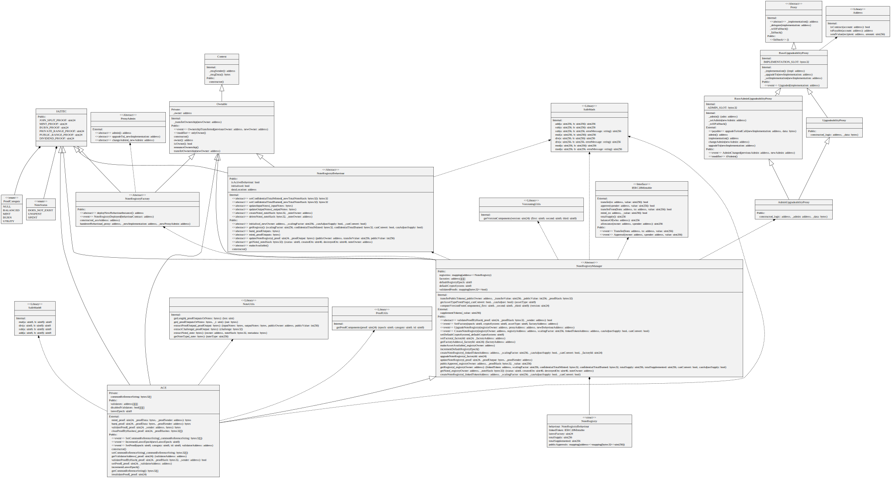
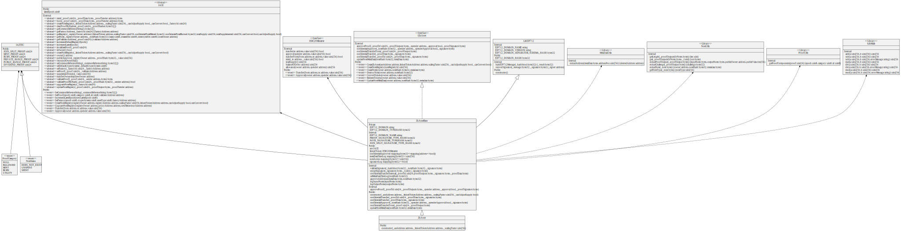
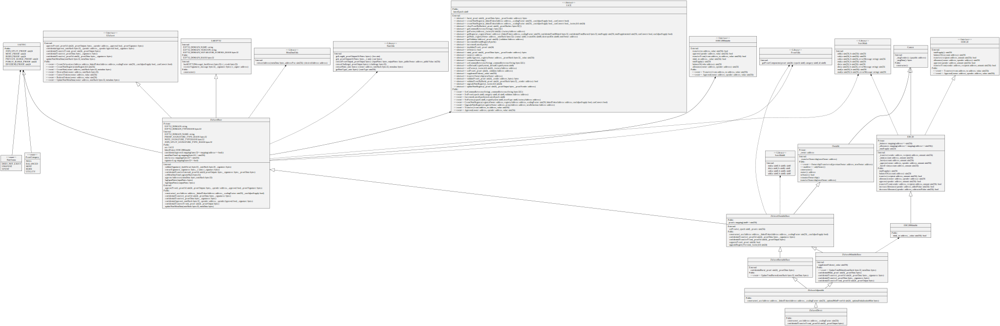
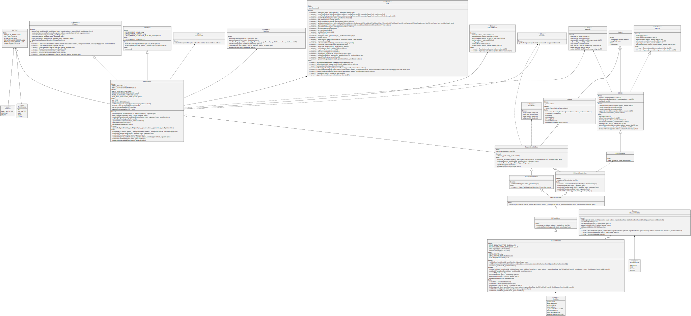

# UML Diagrams of the Aztec contracts

## AZTEC Cryptography Engine (ACE)



```
sol2uml --baseContractNames ACE -o ./docs/ACE.svg
```

## Zero-Knowledge Asset Linked



```
sol2uml --baseContractNames ZkAsset -o ./docs/zkAssetLinked.svg
```

## Zero-Knowledge Asset Direct



```
sol2uml ./scr/chain/contracts --baseContractNames ZkAssetDirect -o ./docs/zkAssetDirect.svg
```

## Zero-Knowledge Asset Holdable



```
sol2uml --baseContractNames ZkAssetHoldable -o ./docs/zkAssetHoldable.svg
```
