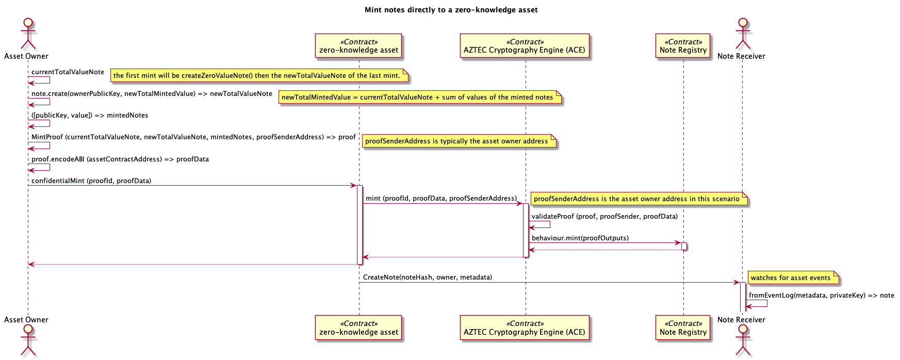
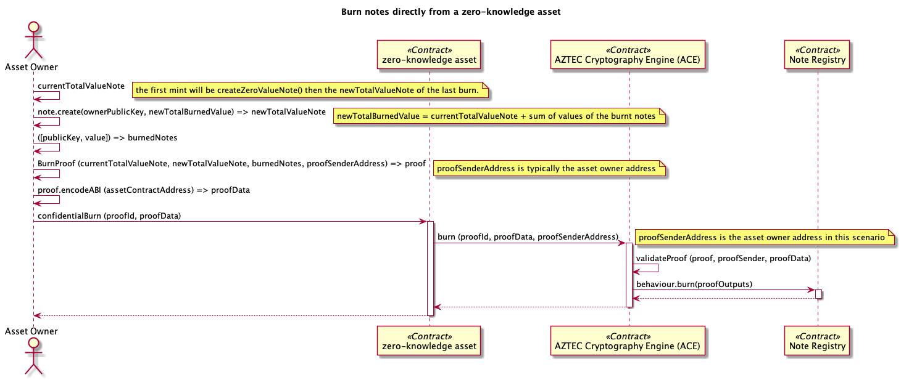
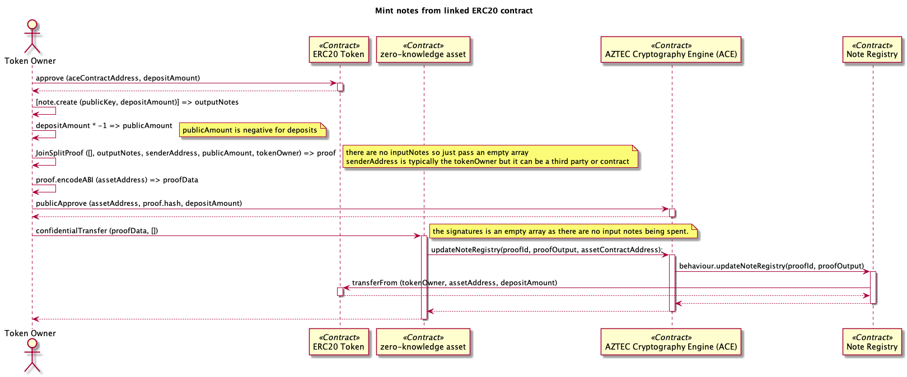
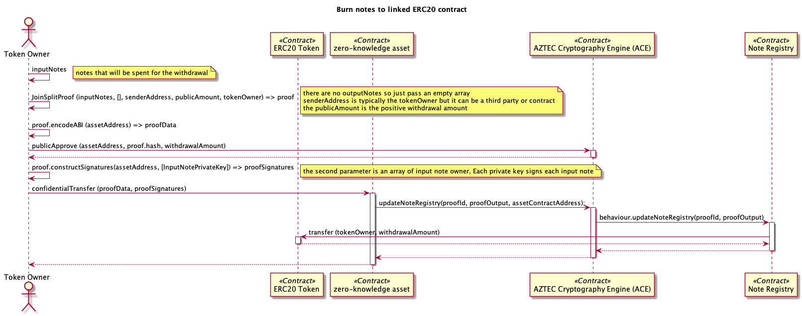
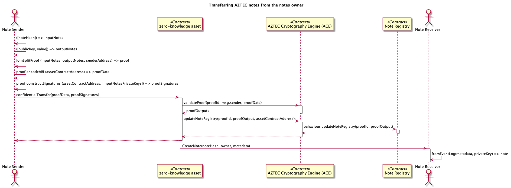
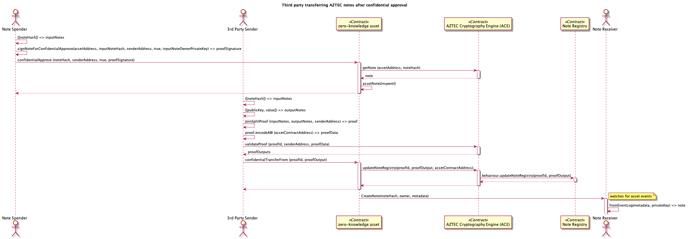
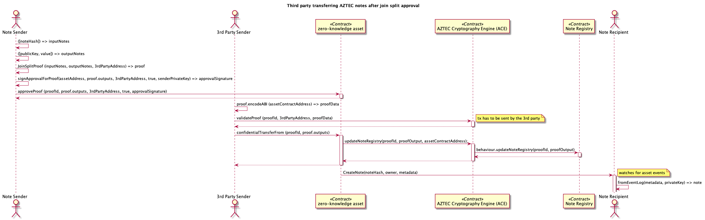
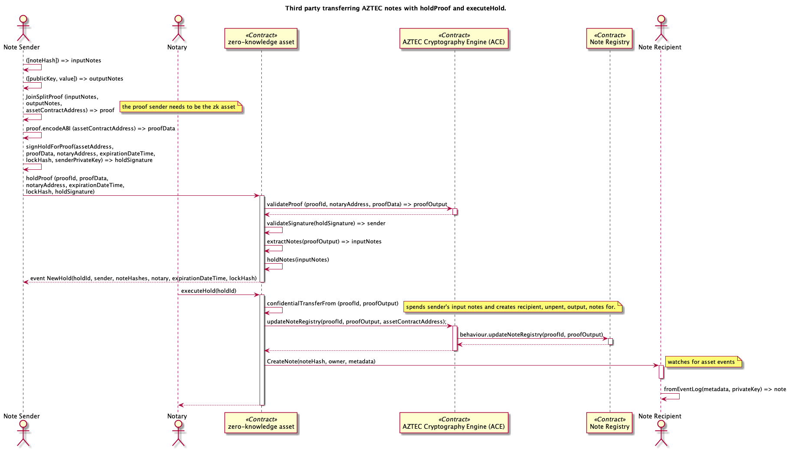
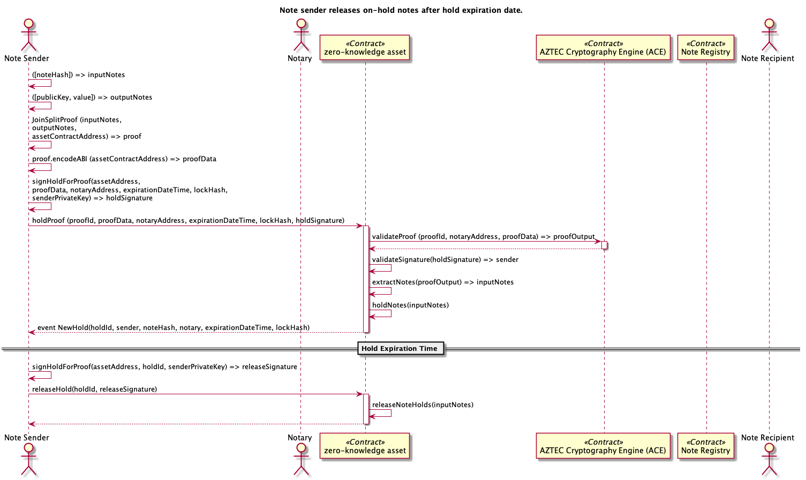
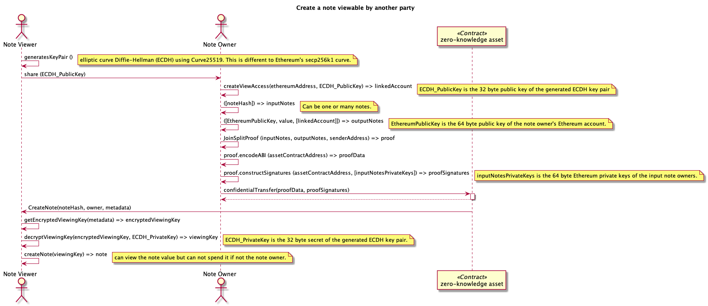

# AZTEC Sequence Diagrams

## Mint notes directly to zero-knowledge asset

[Diagram PlantUML Source](./mintDirect.puml)

- [Minting notes specification](https://docs.aztecprotocol.com/#/%20Specification/Minting%20AZTEC%20notes)
- [Mint Proof API](https://aztecprotocol.github.io/AZTEC/MintProof66049.html)

See [Deployer mints Issuer note 1](../src/__tests__/aztec-assets.test.ts#L355) test for an example in code.

## Burn notes directly from zero-knowledge asset

[Diagram PlantUML Source](./burnDirect.puml)

- [Burn notes speficiation](https://docs.aztecprotocol.com/#/%20Specification/Burning%20AZTEC%20notes)
- [Burn Proof API](https://aztecprotocol.github.io/AZTEC/BurnProof66305.html)

See [Deployer (contract owner) burns note of value 20](../src/__tests__/aztec-assets.test.ts#L840) test for an example in code.

## Deposit from linked ERC20

[Diagram PlantUML Source](./mintLinked.puml)

- [Minting notes specification](https://docs.aztecprotocol.com/#/%20Specification/Minting%20AZTEC%20notes)
- [Join Split API](https://aztecprotocol.github.io/AZTEC/JoinSplitProof65793.html)

See [Issuer deposits tokens to a zero-knowledge note they own](../src/__tests__/aztec-assets.test.ts#L175) test for an example in code.

## Withdrawal to linked ERC20

[Diagram PlantUML Source](./burnLinked.puml)

- [Burning notes specification](https://docs.aztecprotocol.com/#/%20Specification/Burning%20AZTEC%20notes)
- [Join Split API](https://aztecprotocol.github.io/AZTEC/JoinSplitProof65793.html)

See [Issuer withdraws note to linked ERC20 token](../src/__tests__/aztec-assets.test.ts#L279) test for an example in code.

## Confidential transfer

[Diagram PlantUML Source](./confidentialTransfer.puml)

See [Issuing a confidential transaction: confidentialTransfer](https://docs.aztecprotocol.com/#/%20Specification/Interacting%20with%20ACE%3A%20zkAsset) specification.

See [Issuer transfers tokens: 200 bank 1, 600 bank 2, 300 agent bank and 900 themselves](../src/__tests__/aztec-assets.test.ts#L644) test for an example in code.

## Third Party confidential transfer using confidential approve

[Diagram PlantUML Source](./confidentialApproval.puml)

See [confidentialApprove()](https://docs.aztecprotocol.com/#/%20Specification/Interacting%20with%20ACE%3A%20zkAsset) specification.

See [Account 5 spends account 3's note of value 200 to account 4 using confidentialApprove](../src/__tests__/third-party-spender.test.ts#L163) test for an example in code.

## Third Party confidential transfer using approve proof

[Diagram PlantUML Source](./joinSplitApproveProof.puml)

See [approveProof()](https://docs.aztecprotocol.com/#/%20Specification/Interacting%20with%20ACE%3A%20zkAsset) specification.

See [Account 5 spends account 3's note of value 220 to account 4 using approveProof](../src/__tests__/third-party-spender.test.ts#L253) test for an example in code.

## Third Party confidential transfer using hold proof

[Diagram PlantUML Source](./holdProofExecuteHold.puml)

This is an extension of the Aztec protocol using the [IZkAssetHoldable interface](../src/chain/contracts/IZkAssetHoldable.sol) and [ZkAssetHoldable implementation](../src/chain/contracts/ZkAssetHoldable.sol).

See [Buyer holds 100 cash tokens for the seller using the swap contract](../src/__tests__/aztec-holdable-token-swap.test.ts#220) test for an example in code.

## Note sender releases on-hold notes after hold expiration date

[Diagram PlantUML Source](./holdProofReleaseHold.puml)

This is an extension of the Aztec protocol using the [IZkAssetHoldable interface](../src/chain/contracts/IZkAssetHoldable.sol) and [ZkAssetHoldable implementation](../src/chain/contracts/ZkAssetHoldable.sol).

## Using a view key to see a note balance

Access can be granted to other Ethereum accounts so they can view the note's value. This can be done by updating an existing note's metadata or by transfer a note into a new note with linked accounts that are to have view access.

The below process is when access to granted to a new output note from a confidential transfer.

View access is achieved by encrypting a note's viewing key for each account that is given view access using an elliptic curve Diffie–Hellman (ECDH) key agreement scheme. That is, the viewer creates an ECDH key pair and sends the public key to the note owner, the note owner encrypts the viewing key using the viewer's supplied public key. The note owner transfers a note to a new note where the viewer's Ethereum account is linked to the generated ECDH key pair.
The viewer can then decrypt the encrypted viewing key using the private key of the ECDH key pair they created earlier.

[Diagram PlantUML Source](./viewableNote.puml)

See [Assign view access to a new note](../src/__tests__/note.test.ts#L204) test for an example in code.

## Deploying the AZTEC contracts

See [Deploy proof contracts and ACE](../src/__tests__/aztec-assets.test.ts#L98) test for an example in code.
